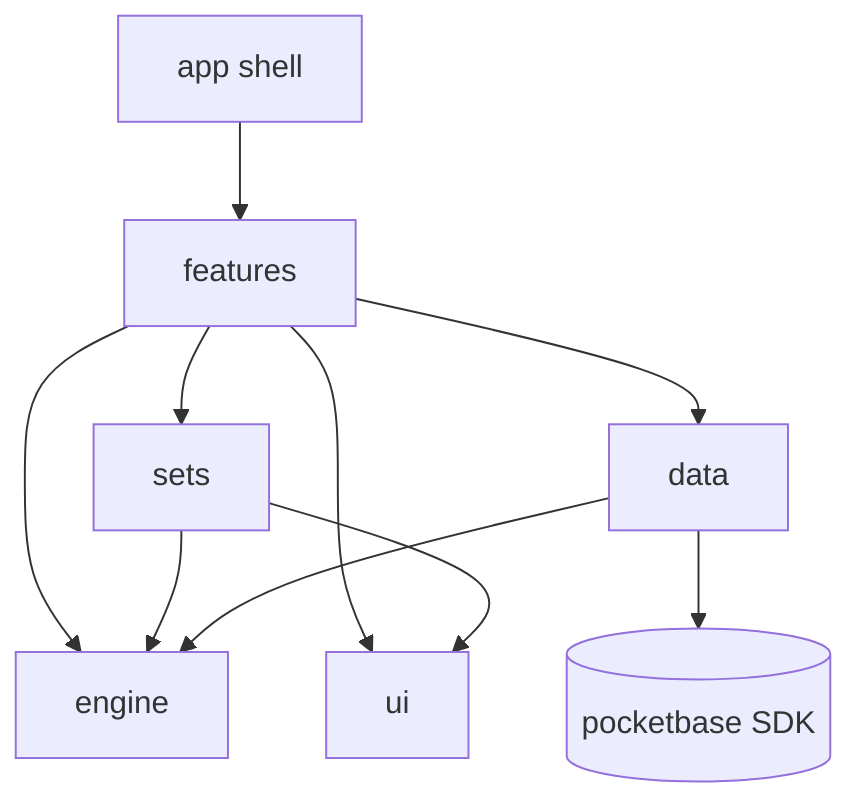
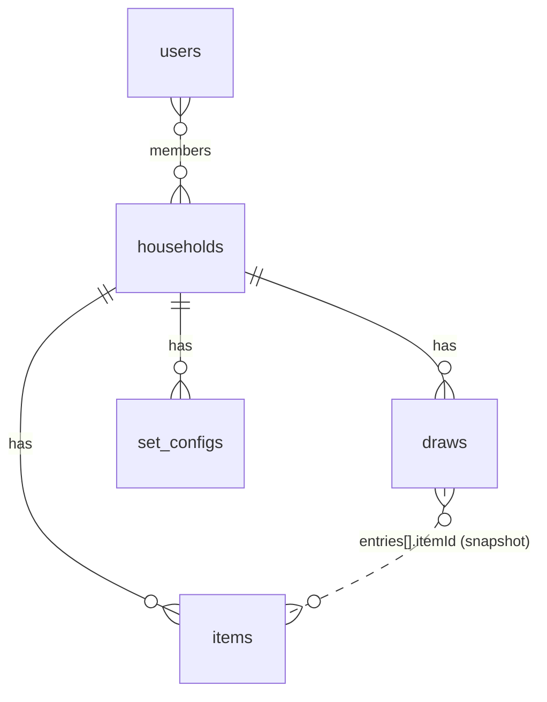
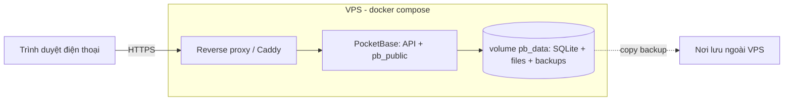

# Architecture Spine: Nồi Thần (app-eat-lucky)

## Design Paradigm

**Modular monolith** phía client, chia theo feature. **Bộ gacha là plugin**: mỗi Bộ là một `SetDefinition` đăng ký vào registry theo `setKey`. **Engine gacha** là hàm thuần, không biết Bộ nào cụ thể. Backend là **PocketBase** tự host (auth, DB, file, realtime), không viết server riêng.

| Lớp | Thư mục | Vai trò |
| --- | --- | --- |
| App shell | `web/src/app/` | Router, tab bar, provider |
| Features | `web/src/features/*` | Màn: `spin`, `tray`, `library`, `item-editor`, `item-detail`, `history`, `settings` |
| Sets (plugin) | `web/src/sets/<setKey>/` | Định nghĩa Bộ: nhóm, khuôn mâm, bộ lọc, trọng số, schema `attrs`, seed, renderer riêng |
| Engine | `web/src/engine/` | Luật quay thuần: độ hiếm, tránh trùng, lọc, bậc trống |
| Data | `web/src/data/` | PocketBase client, repositories, query keys |
| UI kit | `web/src/ui/` | Token từ DESIGN.md, component dùng chung |
| Server | `server/pb_migrations`, `server/pb_hooks` | Schema, API rules, hook |

## Invariants & Rules



Mũi tên là chiều phụ thuộc được phép. `engine` không import gì trong dự án. Không lớp nào import ngược chiều.

### AD-1 — Bộ gacha là plugin trong code, engine không biết Bộ cụ thể [ADOPTED]

- **Binds:** `sets/`, `engine/`, mọi feature
- **Prevents:** logic riêng của "Món ăn" (Mặn/Rau/Canh, mùa, công thức) lọt vào engine hoặc feature, làm việc thêm Bộ thứ hai phải sửa khắp nơi
- **Rule:** Mỗi Bộ export một `SetDefinition` gồm `setKey`, `groups` (key + nhãn + màu), `slotTemplate` (các ô mặc định, ô nào bỏ được), `rarityWeights` (v1: `{1:60, 2:30, 3:10}`), `defaultCooldownDays`, `facets` (bộ lọc theo tag, ví dụ mùa), `attrsSchema`, `seed`, cùng renderer cho chi tiết và trình sửa `attrs`. Feature chỉ đọc Bộ qua `getSet(setKey)`. Trong `engine/` và `features/` cấm so sánh cứng với `'man'`, `'rau'`, `'canh'` hay giá trị mùa. Thêm Bộ mới = thêm thư mục `sets/<setKey>/` và đăng ký vào registry. Bộ do người dùng tự tạo trên UI: xem Deferred.

### AD-2 — Engine gacha là hàm thuần, chạy trên client

- **Binds:** `engine/`, `features/spin`, `features/tray`
- **Prevents:** luật quay bị cài hai lần (client và server) rồi lệch nhau; không test được tỉ lệ
- **Rule:** `engine` export các hàm thuần nhận `(set, items, recentDraws, lockedSlots, filters, now, rng)` và trả kết quả, không đụng I/O, thời gian thật hay `Math.random` trực tiếp (`rng` được tiêm vào). Thứ tự xử lý mỗi ô: lọc nhóm → lọc facet (giá trị chọn + `quanh-nam`) → loại món trong cửa sổ tránh trùng → loại món đã có trong mâm → quay bậc theo `rarityWeights` → bậc trống thì chuyển sang bậc gần nhất còn món (hoà thì lấy bậc thấp hơn) → ô rỗng thì trả `empty`. Món đang khoá 🔒 giữ nguyên, không qua bộ lọc. Thứ tự bật thẻ (món bậc 3 ra cuối) cũng do engine trả về, không để UI tự sắp.

### AD-3 — Server là nguồn dữ liệu chính; mọi dữ liệu người dùng thuộc một Household [ADOPTED]

- **Binds:** mọi collection PocketBase, `data/`
- **Prevents:** v1 làm "một user" cứng, sau này thêm nhiều user hay đồng bộ thì phải chuyển dữ liệu; hai collection phân quyền theo hai kiểu khác nhau
- **Rule:** Mọi collection chứa dữ liệu người dùng có trường `household` (relation, bắt buộc), và cả 5 API rule đều là `household.members.id ?= @request.auth.id`. Create/update còn kiểm thêm `@request.body.household.members.id ?= @request.auth.id`. Không collection nào mở rule rỗng (public). v1: một household, một tài khoản do admin tạo, tắt tự đăng ký. Tuỳ chọn cá nhân theo máy (âm thanh, giảm chuyển động) lưu `localStorage`, không lên server.

### AD-4 — Schema sẵn sàng đồng bộ: ID do client sinh, xoá mềm, draw append-only

- **Binds:** `items`, `draws`, `set_configs`, `data/`
- **Prevents:** bấm lại hoặc gửi lại khi mạng chập chờn tạo bản ghi trùng; xoá món làm hỏng lịch sử; hai máy sửa cùng lúc thì ghi đè lẫn nhau khó đoán
- **Rule:** ID do client sinh theo định dạng PocketBase (15 ký tự `[a-z0-9]`) trước khi gọi create. Gửi lại mà gặp lỗi trùng ID thì coi là thành công. `items` không bao giờ bị xoá hẳn: đặt `deleted=true`, mọi truy vấn quay/thư viện lọc `deleted=false`. `draws` chỉ create hoặc delete, không update; `entries` là **snapshot** `[{itemId, groupKey, name, rarity, order}]` để lịch sử vẫn hiển thị được khi món bị sửa hay xoá. Xung đột: last-write-wins theo từng bản ghi (mặc định của PocketBase), không merge theo trường.

### AD-5 — Chỉ lớp `data/` được nói chuyện với PocketBase

- **Binds:** `data/`, mọi feature
- **Prevents:** gọi SDK rải rác trong UI, mỗi màn cache/invalidate một kiểu; không thay được backend
- **Rule:** Feature chỉ dùng hook từ `data/` (TanStack Query) như `useItems(setKey, filters)`, `useRecentDraws`, `useSaveItem`, `useCommitTray`. Query key lấy từ một file `data/keys.ts` duy nhất. Mutation là cách ghi duy nhất, và mỗi mutation tự invalidate các key liên quan. Import `pocketbase` bên ngoài `data/` là lỗi lint (`no-restricted-imports`).

### AD-6 — Website online-only, không PWA [ADOPTED]

- **Binds:** `app/`, `data/`
- **Prevents:** người này thêm service worker hoặc cache offline, người kia coi server luôn là dữ liệu tươi, dẫn tới hiển thị lệch nhau và lỗi khó dò
- **Rule:** Sản phẩm là website mobile-first mở trong trình duyệt. Không có manifest, không service worker, không persist query cache. Dữ liệu chỉ nằm trong cache bộ nhớ của TanStack Query và refetch khi tab được focus lại. Ghi thất bại (mất mạng, lỗi server) thì báo `AppError` thân thiện kèm nút thử lại; thử lại dùng lại đúng ID do client sinh (AD-4) nên không tạo trùng.

### AD-7 — Mâm đang mở chỉ nằm ở client; chỉ "Chốt mâm" mới ghi

- **Binds:** `features/tray`, `features/spin`, `data/`
- **Prevents:** đổi thử cũng ghi lịch sử hoặc làm món bị tính vào tránh trùng
- **Rule:** Trạng thái mâm (các ô, khoá, thứ tự bật) nằm trong một store zustand của `features/tray`. "Đổi cả mâm", "Đổi món này", "＋ Thêm món" không gọi server. "Chốt mâm" gọi đúng một mutation tạo `draws`. Cửa sổ tránh trùng chỉ tính từ `draws`, dùng `chosenAt` do client ghi (ISO UTC), đếm theo ngày lịch giờ máy. Số ngày: `set_configs.cooldownDays` nếu có, không thì lấy `SetDefinition.defaultCooldownDays`.

### AD-8 — Món mặc định định danh bằng `seedKey`

- **Binds:** `sets/<setKey>/seed`, `data/`, `features/settings`
- **Prevents:** "Khôi phục món mặc định" tạo trùng món hoặc xoá mất món tự thêm
- **Rule:** Seed nằm trong code, mỗi món có `seedKey` ổn định (không đổi giữa các phiên bản). `(household, setKey, seedKey)` là unique index. Khi household chưa có món nào của Bộ thì nạp seed. Khôi phục = upsert theo `seedKey`: đưa về nội dung seed, đặt `deleted=false`. Món có `seedKey` rỗng (tự thêm) không bao giờ bị đụng tới. Ảnh seed là file tĩnh của website, tìm theo `seedKey`.

### AD-9 — Ảnh được xử lý ở client, lưu trong file field

- **Binds:** `features/item-editor`, `data/`, `items.image`
- **Prevents:** upload ảnh gốc 5–10MB, mỗi màn tự cắt và hiển thị một kiểu
- **Rule:** Trước khi upload, client cắt 4:3 và nén sang WebP (cạnh dài ≤ 1200px). Chỉ lưu một file trong `items.image` (PocketBase file field, khai báo thumb `400x300`). Lưới và mâm dùng thumb, chi tiết dùng ảnh gốc. Thứ tự fallback khi hiển thị: ảnh đã upload → ảnh seed theo `seedKey` → minh hoạ đĩa trống.

### AD-10 — Schema chỉ đổi qua migration có commit

- **Binds:** `server/pb_migrations`, deploy
- **Prevents:** schema hoặc API rule ở prod lệch với code do ai đó sửa tay trên trang admin
- **Rule:** Mọi collection, field, index, API rule được tạo hoặc sửa bằng JS migration trong `server/pb_migrations/` và commit cùng code. Ở prod không sửa schema qua giao diện admin. Hook server (`pb_hooks`) chỉ dùng để kiểm tra dữ liệu hoặc seed household, không chứa luật quay (AD-2).

### AD-11 — Triển khai: một image Docker trên VPS [ADOPTED]

- **Binds:** `deploy/`, vận hành
- **Prevents:** front và back lệch phiên bản; dữ liệu mất khi dựng lại container
- **Rule:** Dockerfile multi-stage: build `web/` → image alpine gồm binary PocketBase + `pb_public` (website đã build) + `pb_migrations` + `pb_hooks`. Chạy bằng `docker compose` với một volume `pb_data`. TLS do reverse proxy lo (dùng proxy có sẵn trên VPS, chưa có thì dùng Caddy). Front và back luôn deploy cùng một tag. Bật backup định kỳ tích hợp sẵn của PocketBase, và copy file backup ra ngoài VPS.

## Consistency Conventions

| Concern | Convention |
| --- | --- |
| Tên collection | `snake_case` số nhiều: `households`, `items`, `draws`, `set_configs`; `users` là auth collection |
| Tên field | `camelCase` ở cả DB lẫn TS (không map); relation đặt theo tên thực thể số ít (`household`) |
| Key ổn định | `setKey`, `groupKey`, giá trị facet: `kebab-case` ASCII, không dấu (`food`, `man`, `rau`, `canh`, `xuan`, `ha`, `thu`, `dong`, `quanh-nam`). Nhãn tiếng Việt nằm trong `SetDefinition` |
| Độ hiếm | Số nguyên `1 \| 2 \| 3` (Thường/Ngon/Đặc biệt). Màu và số sao lấy từ token, không lưu vào DB |
| Thời gian | Lưu ISO 8601 UTC; logic theo ngày dùng giờ máy |
| Dữ liệu riêng của Bộ | `items.attrs` (JSON) kiểm tra bằng `SetDefinition.attrsSchema`; Món ăn: `{ingredients: string[], steps: string[], note?: string}`. `items.tags` (JSON `string[]`) là giá trị facet (mùa) |
| Lỗi | Repo ném `AppError {code, message}` với message theo giọng "Nồi Thần" (xem EXPERIENCE.md). UI không hiện lỗi thô của PocketBase |
| Chữ trên UI | Toàn bộ chuỗi hiển thị đặt trong `sets/<setKey>/copy.ts` hoặc `ui/copy.ts`, không rải trong component |
| Chuyển động | Mọi animation đọc `prefers-reduced-motion` qua một hook chung. Rung gọi qua `ui/haptics.ts`, không có `navigator.vibrate` thì bỏ qua |
| Test | Engine phải có unit test (vitest) cho phân bố tỉ lệ, tránh trùng, bậc trống, với `rng` có seed cố định |

## Stack

| Name | Version |
| --- | --- |
| Node (build) | 26.x |
| TypeScript | 7.0.2 |
| Vite | 8.3.1 |
| React | 19.3.0 |
| react-router | 8.4.0 |
| @tanstack/react-query | 5.104.0 |
| zustand | 5.0.15 |
| motion | 13.4.4 |
| pocketbase (JS SDK) | 0.28.1 |
| PocketBase (server) | 0.40.4 |
| Caddy (nếu cần) | 2.11.4 |
| vitest | 5.0.2 |
| @playwright/test | 1.63.0 |

## Structural Seed





Môi trường: **dev** (PocketBase binary hoặc compose chạy local + `vite dev` proxy `/api`) và **prod** (VPS). Không có staging.

```text
app-eat-lucky/
  web/
    src/app/            # shell, router, SW
    src/features/       # spin, tray, library, item-editor, item-detail, history, settings
    src/sets/registry.ts
    src/sets/food/      # definition, seed, copy, renderer attrs
    src/engine/         # luật quay thuần + test
    src/data/           # pb client, repos, keys.ts
    src/ui/             # tokens, components, haptics, copy
    public/seed/        # ảnh món mặc định
  server/
    pb_migrations/
    pb_hooks/
  deploy/
    Dockerfile
    compose.yml
    Caddyfile
```

## Capability → Architecture Map

| Capability / Area (UX) | Lives in | Governed by |
| --- | --- | --- |
| Màn Quay, chip mùa, nút Mở nồi | `features/spin` | AD-1, AD-2 |
| Mâm cơm: 🎲 đổi, 🔒 giữ, ＋ ô, Đổi cả mâm | `features/tray` | AD-2, AD-7 |
| Chốt mâm, tránh trùng N ngày | `features/tray` + `data/` | AD-4, AD-7 |
| Hiệu ứng mở nồi theo độ hiếm | `features/spin` + `ui/` | AD-2 (thứ tự bật), Conventions (chuyển động) |
| Thư viện, lọc nhóm/mùa, tìm | `features/library` | AD-1, AD-5 |
| Thêm/Sửa món, ảnh, công thức | `features/item-editor` | AD-1, AD-9 |
| Lịch sử, vuốt xoá mâm | `features/history` | AD-4 |
| Cài đặt: số ngày, khôi phục món mặc định | `features/settings` | AD-3, AD-7, AD-8 |
| "Bộ: Món ăn ▾" (chừa sẵn) | `features/spin` + `sets/registry` | AD-1 |

## Deferred

- **Bộ do người dùng tự tạo trên UI**: v1 chỉ có Bộ trong code. Nếu cần thì chuyển `SetDefinition` thành dữ liệu (collection `sets`) mà engine không phải đổi (AD-2).
- **Nhiều user / nhiều household thật**: mời thành viên, đăng ký, chọn household. Làm khi có người thứ hai dùng; AD-3 đã chừa sẵn phạm vi dữ liệu.
- **Realtime giữa nhiều máy** (subscribe PocketBase): làm khi có nhiều thiết bị; v1 refetch khi focus là đủ.
- **Đồng bộ mâm đang mở giữa các máy**: không cần cho v1 (AD-7).
- **Offline / PWA**: đã bỏ khỏi v1 (AD-6). Nếu sau này cần thì thêm service worker và persist cache; AD-4 (ID do client sinh) đã chừa sẵn đường cho hàng đợi ghi.
- **CI/CD, giám sát, log tập trung**: v1 build và deploy tay bằng `docker compose`; thêm khi deploy thường xuyên.
- **Âm thanh** (thư viện, định dạng file): quyết khi làm hiệu ứng; mặc định tắt theo UX.
- **Lịch backup cụ thể và nơi lưu ngoài VPS**: chốt lúc cài đặt VPS.
